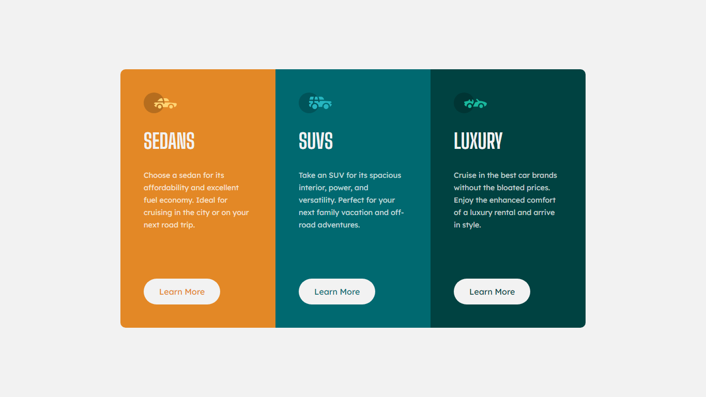

# 3 Column Preview Card Component Challenge

This README.md file provides an overview of the "3 Column Preview Card Component" challenge, which is available on Frontend Mentor. This challenge involves creating a responsive web component for desktop screens.

## Challenge Description

The "3 Column Preview Card Component" challenge is part of Frontend Mentor's collection of web development challenges. In this challenge, the task is to create a responsive preview card component with three columns for desktop screens. The provided design includes three cards side by side, each containing an image, a heading, and a paragraph of text. The challenge emphasizes the use of HTML and CSS to create the layout and styling.

## Challenge Features

* Three preview cards side by side.
* Each card contains an image, a heading, and a paragraph of text.
* Responsive design for desktop screens.

## My Solution

I have completed the "3 Column Preview Card Component" challenge for desktop screens. My solution demonstrates the use of HTML and CSS to create a responsive layout that closely matches the provided design.

## Technologies Used

* **HTML**
* **CSS**

## Screenshot

## Additional Notes

* This challenge was completed for the desktop version only. For mobile and tablet responsiveness, further CSS adjustments may be required.

* I encourage you to try the challenge yourself on Frontend Mentor and compare your solution with mine.

## Contact

If you have any questions or feedback about my solution, feel free to reach out to me through [**GitHub.**](https://github.com/muhaideennausar)

Happy coding! 🚀